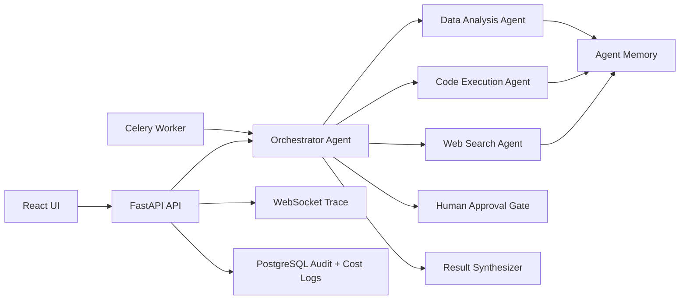

# AI-Powered Multi-Agent Workflow Automation Platform

This repository is a full-stack MVP scaffold for a multi-agent workflow system where an orchestrator breaks a user goal into subtasks, delegates work to specialist agents, streams trace events, pauses for human approval, and stores audit/cost data.

## What Is Included

- FastAPI backend with REST and WebSocket endpoints
- LangGraph-ready orchestrator with a deterministic fallback planner
- Web Search, Code Execution, and Data Analysis agents
- Human approval gate for risky or irreversible steps
- PostgreSQL audit tables for runs, subtasks, events, API calls, and memory
- Chroma-backed memory when an OpenAI key is configured, with database fallback
- Cost tracker for OpenAI usage logs and per-run budget caps
- React + Tailwind operator dashboard
- Celery worker and Redis wiring
- Docker Compose for local deployment
- GitHub Actions pipeline for tests, image build, ECR push, and EC2 deploy

## Architecture



## Local Run

1. Copy the environment template.

```bash
cp .env.example .env
```

2. Add provider keys in `.env` if you want live LLM planning, embeddings, or web search.

```bash
OPENAI_API_KEY=...
TAVILY_API_KEY=...
```

3. Start the stack.

```bash
docker compose up --build
```

4. Open the app and API docs.

- UI: http://localhost:5173
- API docs: http://localhost:8000/docs

The app runs without provider keys by using deterministic fallbacks. Live search requires `TAVILY_API_KEY` or `SERPER_API_KEY`; LLM planning and Chroma embeddings require `OPENAI_API_KEY`.

## API Surface

- `POST /api/v1/runs` creates a run and starts execution
- `GET /api/v1/runs` lists recent runs
- `GET /api/v1/runs/{run_id}` returns run detail, subtasks, events, and API calls
- `POST /api/v1/runs/{run_id}/approval` approves or stops a waiting run
- `WS /api/v1/ws/runs/{run_id}` streams live agent events

## Agent Safety Controls

- `MAX_ITERATIONS` prevents runaway agent loops
- `AGENT_TIMEOUT_SECONDS` kills slow agent steps
- `DEFAULT_BUDGET_USD` and per-run budgets hard-stop expensive runs
- Approval gates pause execution before risky steps
- Code execution runs in a short-lived isolated Python subprocess

For production-grade untrusted code execution, run the code agent inside a locked-down container, microVM, or managed sandbox.

## AWS Deployment Notes

The GitHub Actions workflow expects these secrets:

- `AWS_REGION`
- `AWS_ROLE_TO_ASSUME`
- `PUBLIC_API_URL`
- `EC2_HOST`
- `EC2_USER`
- `EC2_SSH_KEY`

The EC2 host should have Docker, Docker Compose, AWS CLI, and a checked-out copy of this repository at `/opt/multi-agent`. Use Amazon RDS or another managed PostgreSQL service for production data.

## Suggested Next Milestones

1. Add a durable Redis pub/sub stream so Celery worker events reach WebSocket clients across processes.
2. Replace fallback planning with stricter structured LLM outputs and task-specific prompts.
3. Move code execution to container isolation with filesystem and network policies.
4. Add PDF artifact generation and S3 upload for the resume demo.
5. Add auth, org-level quotas, and per-user cost dashboards.

